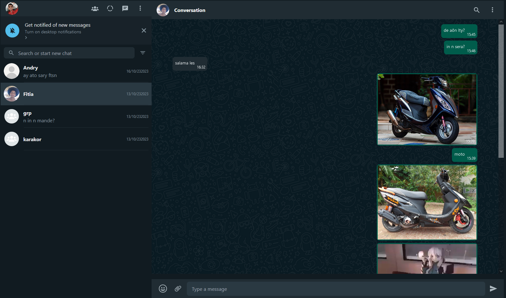

# WhatsApp Clone Frontend

Built using React, Redux, and TailwindCSS, our front-end provides a seamless and user-friendly experience that closely mirrors the look and some core functionalities of WhatsApp.

**Note:** This repository is the frontend component of the WhatsApp Clone and should be used in conjunction with the corresponding [backend](https://github.com/MorenoRajaonarison/whatsappBack) repository for full functionality.

## Description

Crafted with **React**, our front-end interface offers a smooth and intuitive user experience, allowing users to send and receive real-time messages, including text, images, videos, and files. Additionally, the application supports online status and typing indicators. Users can search for other users to start conversations.

## Features

- User Registration and Login
- Real-time Chat (text, image, video, file)
- Online Status and Typing Indicator
- User Search

## Environment Variables

To run this project, you may need to configure environment variables.

`REACT_APP_API_ENDPOINT` / api endpoint

`REACT_APP_CLOUD_NAME` / cloud name from cloudinary

`REACT_APP_CLOUD_SECRET` / cloud secret from cloudinary

`REACT_APP_DARK_BG` / https://res.cloudinary.com/dmhcnhtng/image/upload/v1677358270/Untitled-1_copy_rpx8yb.jpg

## Run Locally

Clone the project

```bash
  git clone https://github.com/MorenoRajaonarison/whatsappFront.git
```

Go to the project directory

```bash
  cd whatsappFront
```

Install dependencies

```bash
  npm install
```

Start the server

```bash
  npm run start
```

## Tech Stack

**Client:** React, Redux, TailwindCSS

**Server:** Node, Express, Socket.io

## Preview



## Authors

- [@Rajaonarison](https://www.github.com/octokatherine)
